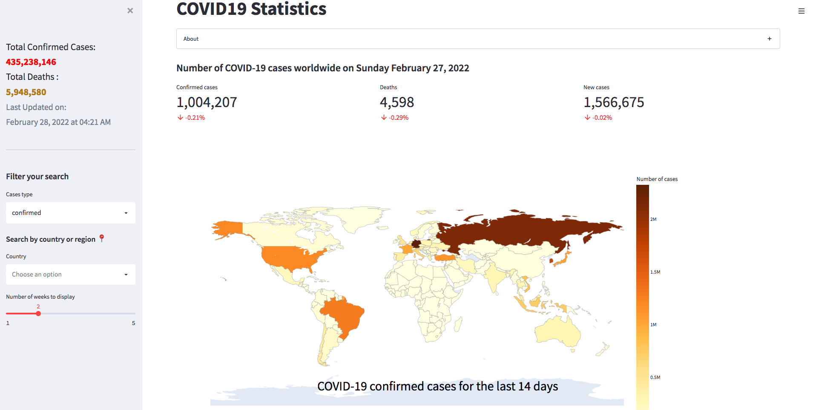
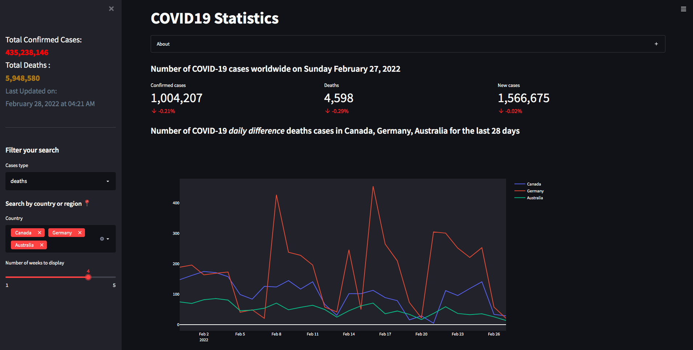

# COVID19 Dashboard
This is a COVID-19 Dashboard web application with several visualizations of statistics over time.  
The application can be accessed [**here**](https://c19statistics.herokuapp.com/).
# Demo-Preview

# Table of contents
- [Project Title](#covid19-dashboard)
- [Demo-Preview](#demo-preview)
- [Usage](#usage)
- [Development](#development)
- [Contribute](#contribute)
# Usage
This [**COVID-19 Dashboard**](https://c19statistics.herokuapp.com/) has multiple visualization functionalities, like displaying more details when you hover on the region(map) or any other plot.  
For instance, it allows comparing statistics about `confirmed cases`, `death cases`, as well as `new cases(latest week average)` of up to 215 countries/regions.    

> **_NOTE:_**  All plots are extendable, and downloadable.
# Development
- This web application uses public data published by Johns Hopkins CSSE, and uses its [**RapidAPI**](https://rapidapi.com/axisbits-axisbits-default/api/covid-19-statistics/details) to collect all the data.   Meanwhile, for optimization purposes, this application uses the best `caching` practices by storing historical data on a `MySQL` database hosted on `Microsoft Azure`, as well as `Streamlit's` session caching upon usage.   Finally, this application synchronuously updates the cached data with the Johns Hopkins CSSE's API on a daily basis.
# Contribute
For any suggestion or feedback, please feel free to reach out to me via [email](mailto:njucesar@gmail.com).
# License
[(Back to top)](#covid19-dashboard)

All the code is open source, feel free to integrate it in your projects!

[GNU General Public License version 3](https://opensource.org/licenses/GPL-3.0)
